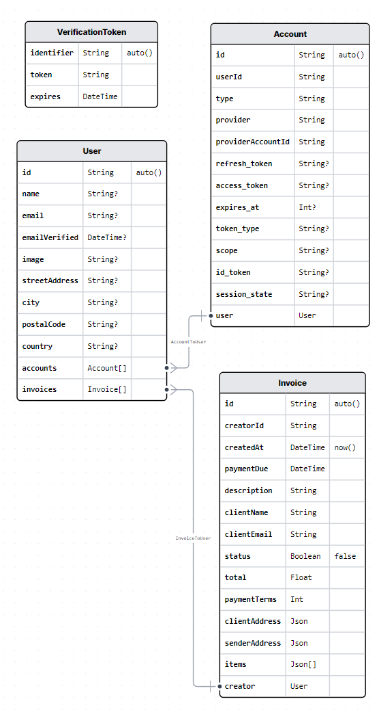
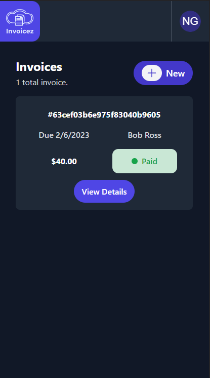
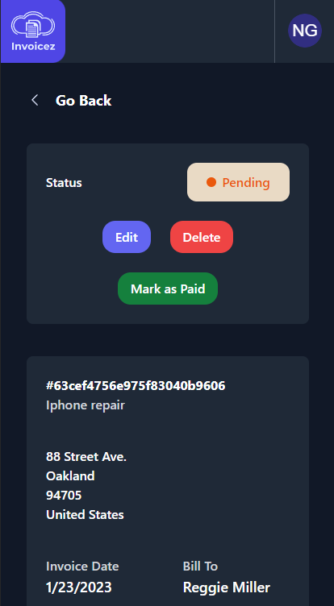
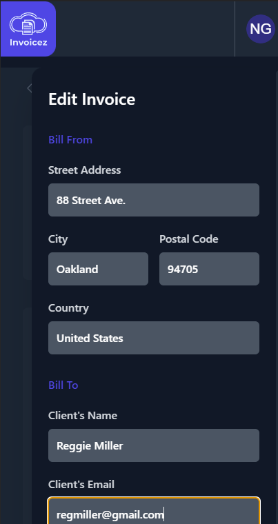
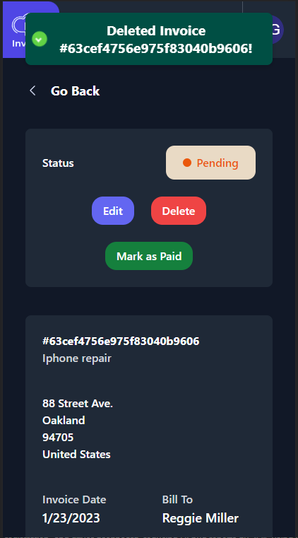
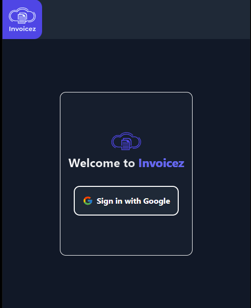

# Invoicez

Create invoices on the go and access them later to view, delete or update.

## Tech Stack

**Client:** React, TailwindCSS, Typescript, React Hot Toast

**Server:** Next.js, Prisma, MongoDb, NextAuth

## Demo

[Live](http://invoicez.vercel.app/)

## Screenshots
### Prisma Schema
 

### CRUD Features

### Login/Sign Up Via Google Provider 

## Documentation

[Next.js](https://nextjs.org/docs/getting-started)
[NextAuth](https://next-auth.js.org/getting-started/example)
[mongodb](https://www.mongodb.com/docs/)
[Tailwind](https://tailwindcss.com)
[prisma](https://www.prisma.io/docs)
